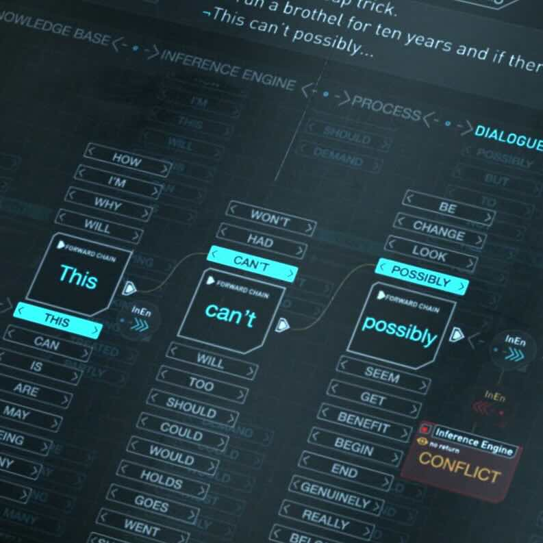

# star-bits

Initial singularity → Light elements → ⭐ Stars → Heavier elements → 🌏 Earth → 👫 Humans → 👣 Giants → ⚡🧠 Intelligence

## slides and code from presentations i've given:
- [nn.md](https://github.com/star-bits/sogangparrot/blob/main/nn.md): on neural networks
  - with focus on how to calculate the partial derivative, ∂L/∂w, at each layer
- [nlp.md](https://github.com/star-bits/sogangparrot/blob/main/nlp.md): on natural language processing
  - with topics ranging from word2vec to RLHF, multimodal, and CoT
- [it.ipynb](https://colab.research.google.com/github/star-bits/sogangparrot/blob/main/it.ipynb): on how to instruct-tune gemma-2-2b-it with lora

## blog posts:
- [thought-token](posts/thought-token.html): (token-level) latent space에서 thought token으로 CoT 하기 (Coconut)
- [concept-model](posts/concept-model.html): sentence-level latent space에서 diffusion으로 reasoning 하기 (LCM)
- [entropy-patch](posts/entropy-patch.html): byte끼리 entropy를 기준으로 묶어서 patch를 만들고 token 대신 사용하기 (BLT)
- [socratic-learning](posts/socratic-learning.html): language space에서의 pure recursive self-improvement
- [thought-templates](posts/thought-templates.html): 해당 reasoning task에 적합한 thought template으로 RAG 하기 (BoT)
- [testtime-compute](posts/testtime-compute.html): 같은 FLOPs에서 test-time compute와 pretraining cost의 tradeoff 관계
- [selftaught-reasoner](posts/selftaught-reasoner.html): reasoning trace 데이터셋의 self-feeding amplification loop (STaR)
- [rstar-math](posts/rstar-math.html): rounds of MCTS-assisted code-augmented reasoning traces (rStar-Math)
- [latent-diffusion](posts/latent-diffusion.html): latent space에서 noise predictor를 steering 하기
- [decoupled-cross](posts/decoupled-cross.html): decoupled cross-attention으로 텍스트와 이미지 프롬프트를 넣어주기

## side projects:
- [ui-time](https://github.com/star-bits/ui-time): add a 15-minute countdown timer in your macOS menu bar
- [prettyURL](https://github.com/star-bits/prettyURL): click the extension icon to copy human readable URL
- [giftMacro](https://github.com/star-bits/giftMacro): when you need to smash that button in your phone at superhuman speed
